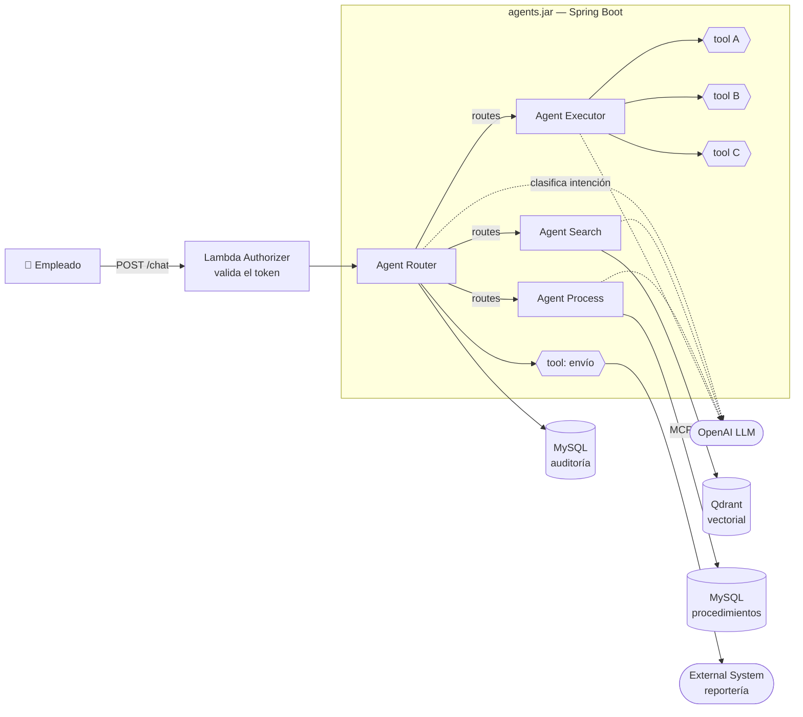
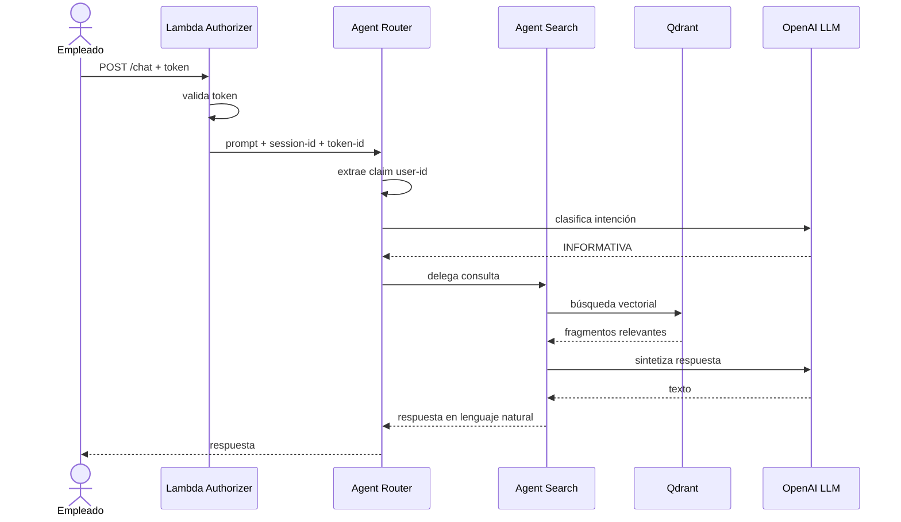
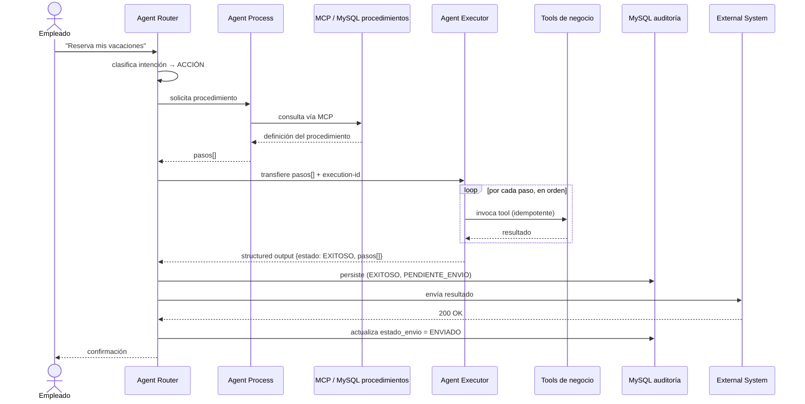
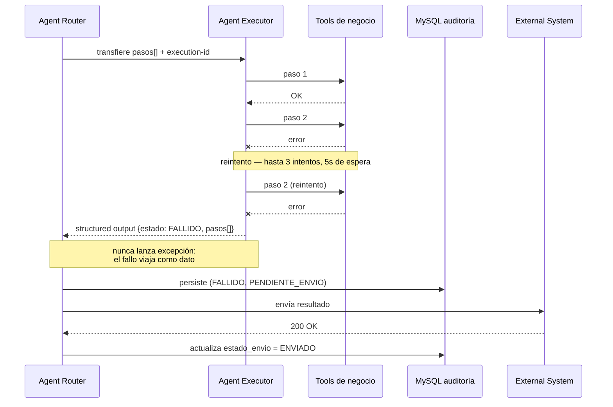
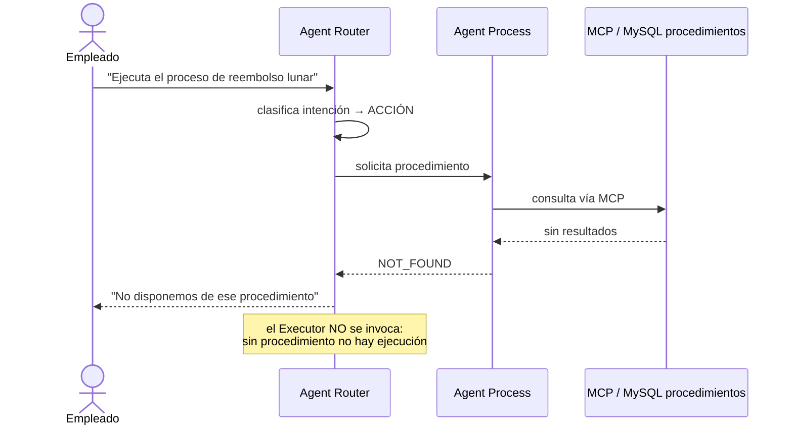
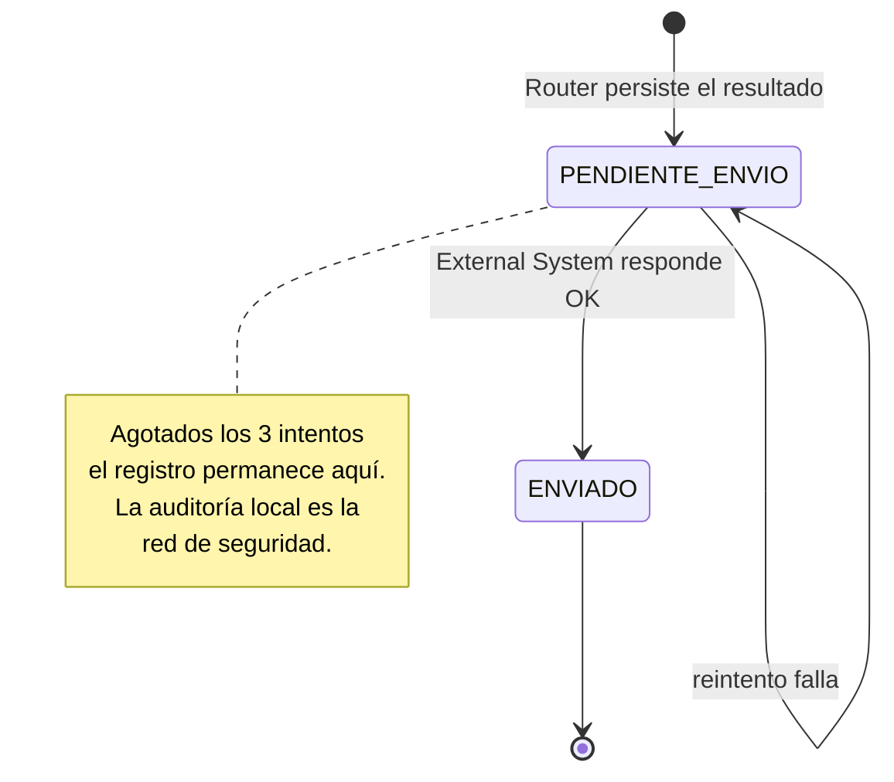

# Sprint AI

Sistema multi-agente construido con **Spring AI** que atiende peticiones de empleados en lenguaje natural y las resuelve por una de dos vías: **responder con información** de la documentación corporativa, o **ejecutar un procedimiento** de negocio definido en base de datos.

El problema que resuelve: en una organización, las preguntas de los empleados ("¿cuántos días de vacaciones me quedan?") y las acciones que solicitan ("resérvame vacaciones el lunes") requieren tratamientos radicalmente distintos — la primera es una consulta de solo lectura, la segunda tiene efectos reales y necesita trazabilidad, control de fallos e idempotencia. Sprint AI separa ambos caminos de forma explícita y hace que **ninguna acción pueda ejecutarse sin un procedimiento previamente definido y almacenado**.

> **Naturaleza del proyecto:** aplicación de muestra con fines didácticos. Prioriza claridad arquitectónica sobre robustez de producción.

---

## Tabla de contenidos

- [Arquitectura](#arquitectura)
- [Componentes](#componentes)
- [Enrutamiento](#enrutamiento)
- [Diagramas de secuencia](#diagramas-de-secuencia)
- [Contratos de datos](#contratos-de-datos)
- [Políticas transversales](#políticas-transversales)
- [Requisitos previos](#requisitos-previos)
- [Instalación](#instalación)
- [Configuración](#configuración)
- [Uso](#uso)
- [Estado del proyecto](#estado-del-proyecto)

---

## Arquitectura

Los cuatro agentes viven en un **único artefacto** (`agents.jar`), no como servicios independientes. El **Agent Router** es el único punto de entrada y salida: los agentes especializados nunca se comunican entre sí ni con el usuario directamente.



### Vista general del flujo

```text
Actor ──HTTP POST──→ [Lambda Authorizer: valida token] ──→ agents.jar (Spring Boot, Java 17)
                                                              │
                                                          ROUTER
                                                          · claim user-id del token (no valida)
                                                          · clasifica intención (ChatClient)
                                                              │
      ┌───────────────────────────────────────────────────────┴──────────┐
      │ INFORMATIVA / ambiguo                          ACCIÓN            │
      ↓                                                   ↓              │
   SEARCH ──→ Qdrant                                   PROCESS ──MCP──→ MySQL.procedimientos
      │                                                   │
      └──→ Router → Usuario                    ┌──────────┴──────────┐
                                          NOT_FOUND              pasos[]
                                               │                     │
                                     Router → Usuario            ROUTER
                                     "No disponemos..."             ↓
                                                                 EXECUTOR
                                                            tool A / B / C
                                                            3 reintentos × 5s, idempotentes
                                                            {execution-id}:{step-index}
                                                                    ↓
                                                          structured output → POJO
                                                                    ↓
                                                                 ROUTER
                                                    1. MySQL.auditoria (estado_ejecucion + estado_envio)
                                                    2. tool → External System (3 reintentos × 5s)
```

### Stack

| Capa | Tecnología | Versión |
|---|---|---|
| Lenguaje | Java | 17 |
| Framework | Spring Boot | 4.1.1 |
| Framework de agentes | Spring AI | 2.0.1 |
| Build | Maven | Wrapper incluido (`mvnw`) |
| Modelo de lenguaje | OpenAI | vía `spring-ai-starter-model-openai` |
| Base vectorial | Qdrant | Consumida por Agent Search |
| Base relacional | MySQL | Una instancia, dos esquemas |
| Coordenadas Maven | `com.bardalez:agents` | `0.0.1-SNAPSHOT` |

---

## Componentes

| Componente | Responsabilidad | Lee / Escribe | Efectos secundarios |
|---|---|---|---|
| **Agent Router** | Clasificar intención, orquestar, persistir y publicar | Escribe `MySQL.auditoria`, llama al External System | Sí |
| **Agent Search** | Responder preguntas desde documentación corporativa | Lee Qdrant | No (solo lectura) |
| **Agent Process** | Recuperar la definición de un procedimiento | Lee `MySQL.procedimientos` vía MCP | No (solo lectura) |
| **Agent Executor** | Ejecutar las tools en el orden que dicta el procedimiento | Invoca tools de negocio | Sí |

### Agent Router

Es el **hub** de la arquitectura. Único componente que conoce al usuario y a la persistencia.

Responsabilidades:

1. **Extraer la identidad.** Toma el claim `user-id` del token recibido. **No valida el token** — un Lambda Authorizer situado delante del sistema ya lo hizo. El Router confía en el token que le llega.
2. **Clasificar la intención** del prompt mediante una llamada al LLM.
3. **Enrutar** al agente correspondiente y recibir su respuesta.
4. **Persistir** el resultado de toda ejecución en el esquema de auditoría.
5. **Publicar** el resultado al External System mediante una tool.

Nunca ejecuta lógica de negocio propia.

### Agent Search

Atiende la rama informativa. Realiza búsqueda vectorial sobre Qdrant, recupera los fragmentos relevantes de la documentación de la empresa y sintetiza una respuesta en lenguaje natural que devuelve al Router.

Es **estrictamente de solo lectura**: no produce ningún efecto sobre ningún sistema. Por eso es el destino seguro por defecto ante intenciones ambiguas.

### Agent Process

Recupera de `MySQL.procedimientos`, **a través de un servidor MCP**, la definición del procedimiento que el usuario solicitó, y la entrega al Router.

Separa el *qué hacer* del *hacerlo*: Process solo lee la definición. Esto convierte cada procedimiento en un **dato versionable en base de datos**, no en lógica incrustada en un prompt.

Dos salidas posibles:

| Salida | Significado | Acción del Router |
|---|---|---|
| `pasos[]` | Procedimiento encontrado | Invoca al Agent Executor |
| `NOT_FOUND` | No existe ese procedimiento | Responde en lenguaje natural: *"No disponemos de ese procedimiento"*. **No** hay fallback a Search |

### Agent Executor

Recibe los pasos que el Router obtuvo de Process e invoca las tools **en el orden que la definición especifica**. No decide el orden: lo obedece.

Garantías de diseño:

- **Nunca lanza excepción hacia arriba.** Siempre devuelve el mismo contrato JSON, con `estado` como discriminante.
- **Todas las tools son idempotentes**, porque cada paso se reintenta.
- **Reporta el detalle paso a paso**, no solo el resultado global.

En el diagrama de arquitectura las tools aparecen como `tool A`, `tool B` y `tool C`: son **marcadores de posición**, aún sin nombres de dominio definitivos.

---

## Enrutamiento

La clasificación es **exclusiva**: cada prompt va a exactamente una rama. La decide el LLM midiendo **intención**, no forma gramatical.

### Reglas

| Intención | Ejemplos de prompt | Destino |
|---|---|---|
| **Informativa** | `¿Cómo solicito vacaciones?`<br/>`¿Se puede pedir licencia sin goce?`<br/>`¿Esto funcionaría en mi caso?`<br/>`Dame más información sobre...`<br/>`Tengo este fallo...` | **Agent Search** |
| **Acción** | `Ejecuta el proceso de...`<br/>`Haz...`<br/>`Reserva mis vacaciones` | **Agent Process → Agent Executor** |
| **Ambigua** | Intención no determinable con confianza | **Agent Search** (por defecto) |

### El eje real: intención sobre gramática

El criterio no es el modo verbal. Estos dos casos frontera lo ilustran:

| Prompt | Forma | Intención | Destino |
|---|---|---|---|
| `Dime cómo reservar vacaciones` | Imperativo | Informativa | **Search** |
| `Necesito vacaciones el lunes` | Declarativo | Acción | **Process → Executor** |

Ante la duda, el sistema degrada hacia **Search**, la rama sin efectos secundarios. Equivocarse hacia una lectura es recuperable; equivocarse hacia una escritura, no.

### Invariante de seguridad

> **El camino `Router → Executor` no es una entrada independiente.** Obligatoriamente debe pasar antes por `Router → Process`. Si Process no devolvió un procedimiento, el Router **no puede** invocar al Executor.

Consecuencia: **no existe ningún camino para ejecutar tools sin una definición de procedimiento previa en base de datos.** El LLM nunca decide *qué* acciones ejecutar — solo en qué orden invocar tools que un procedimiento ya autorizó. La superficie de acción del sistema está acotada por datos, no por el prompt.

---

## Diagramas de secuencia

### Rama informativa



Sin escrituras: esta rama no toca auditoría ni el External System.

### Rama de ejecución — caso exitoso



### Rama de ejecución — fallo en un paso



### Procedimiento inexistente



### Inconsistencia parcial: una decisión deliberada

Cuando el paso 2 falla y el paso 1 ya se ejecutó, el proceso queda **parcialmente ejecutado**, no *no ejecutado*. El sistema **no implementa rollback ni compensación**: registra el detalle por paso y deja que una persona resuelva la inconsistencia.

Esto es aceptable porque **cada transacción es individual por empleado**. Si la solicitud de vacaciones de un trabajador falla a medias, no afecta a ningún otro: no hay radio de impacto compartido.

---

## Contratos de datos

### Structured output del Agent Executor

Contrato único que atraviesa `Executor → Router → auditoría → External System`. Spring AI lo materializa directamente en un POJO mediante `ChatClient`.

```json
{
  "executionId": "b3f1a9e4-7c2d-4a11-9f30-8d5e6c0a1b22",
  "userId": "e.bardalez",
  "sessionId": "s-77c1f0",
  "procedimiento": "RESERVA_VACACIONES",
  "estado": "FALLIDO",
  "pasos": [
    {
      "stepIndex": 1,
      "nombre": "validarSaldoVacaciones",
      "estado": "EXITOSO",
      "intentos": 1,
      "mensaje": null
    },
    {
      "stepIndex": 2,
      "nombre": "registrarSolicitud",
      "estado": "FALLIDO",
      "intentos": 3,
      "mensaje": "Timeout al conectar con el sistema de RRHH"
    },
    {
      "stepIndex": 3,
      "nombre": "notificarSupervisor",
      "estado": "NO_EJECUTADO",
      "intentos": 0,
      "mensaje": null
    }
  ]
}
```

### Esquema de auditoría

```sql
CREATE TABLE ejecucion (
    execution_id      CHAR(36)     PRIMARY KEY,
    user_id           VARCHAR(100) NOT NULL,
    session_id        VARCHAR(100) NOT NULL,
    procedimiento     VARCHAR(120) NOT NULL,
    estado_ejecucion  VARCHAR(20)  NOT NULL,
    estado_envio      VARCHAR(20)  NOT NULL,
    pasos             JSON         NOT NULL,
    creado_en         TIMESTAMP    DEFAULT CURRENT_TIMESTAMP
);
```

> **`user_id` guarda el claim extraído del token, nunca el token.** Un log de auditoría que almacene credenciales se convierte en un almacén de secretos.

### Dos estados independientes

Son dimensiones distintas y **no deben mezclarse en un solo campo**:

| Campo | Valores | Significa |
|---|---|---|
| `estado_ejecucion` | `EXITOSO`, `FALLIDO` | Si el procedimiento se completó |
| `estado_envio` | `PENDIENTE_ENVIO`, `ENVIADO` | Si el External System llegó a saberlo |

La combinación relevante es `EXITOSO` + `PENDIENTE_ENVIO`: **el procedimiento se ejecutó correctamente, pero el sistema externo nunca se enteró.** Ese caso debe ser consultable — es precisamente el que la reportería externa no puede detectar por sí sola.



### Estados de un paso

| Estado | Significado |
|---|---|
| `EXITOSO` | El paso se completó |
| `FALLIDO` | Falló tras agotar los reintentos |
| `NO_EJECUTADO` | No se intentó: un paso anterior falló primero |

---

## Políticas transversales

### Reintentos

Una sola política, aplicada en los dos únicos puntos que la necesitan:

| Punto de aplicación | Intentos | Espera entre intentos |
|---|---|---|
| Paso del Executor | 3 | 5 s |
| Envío al External System | 3 | 5 s |

Deliberadamente **sin backoff exponencial, sin cola durable y sin worker de reintento**. Si los 3 intentos de envío se agotan, el registro queda en `PENDIENTE_ENVIO` y la auditoría local cumple su función. Para un sistema de producción el patrón correcto sería un *outbox* con worker desacoplado; aquí sería complejidad sin valor didáctico.

### Idempotencia

**Toda tool debe ser idempotente**, porque todo paso se reintenta. La clave de idempotencia es:

```text
{execution-id}:{step-index}
```

El `execution-id` lo genera el Router al invocar al Executor.

> **No basta con `session-id`.** Si un empleado solicita vacaciones dos veces en la misma sesión, la segunda solicitud sería descartada como duplicado falso. El `execution-id` distingue ejecuciones; el `step-index`, pasos dentro de una ejecución.

### Autenticación e identidad

| Aspecto | Responsable |
|---|---|
| Autenticación y autorización | IAM externo |
| Validación del token | **Lambda Authorizer**, delante del sistema |
| Extracción del claim `user-id` | **Agent Router** |

Sprint AI **no valida tokens**: cuando un prompt llega al Router, el token ya fue validado. El Router solo lee el claim de identidad.

Cada petición transporta, de forma transparente para el usuario:

| Dato | Uso |
|---|---|
| `token-id` | Fuente del claim `user-id`. **No se persiste** |
| `session-id` | Correlación de la conversación. Se persiste en auditoría |

---

## Requisitos previos

| Herramienta | Versión | Notas |
|---|---|---|
| JDK | 17 | Baseline del proyecto |
| Maven | — | No requiere instalación: usa el wrapper `mvnw` |
| MySQL | 8.x | Una instancia con dos esquemas |
| Qdrant | — | Alcanza con el contenedor oficial |
| Clave de API de OpenAI | — | Ver [Configuración](#configuración) |

---

## Instalación

```bash
git clone <url-del-repositorio>
cd agents/agents

# Compilar y ejecutar las pruebas
./mvnw clean verify

# Levantar la aplicación
./mvnw spring-boot:run
```

En Windows, sustituye `./mvnw` por `mvnw.cmd`.

Para generar el artefacto ejecutable:

```bash
./mvnw clean package
java -jar target/agents-0.0.1-SNAPSHOT.jar
```

---

## Configuración

### Variables de entorno

| Variable | Obligatoria | Descripción |
|---|---|---|
| `OPENAI_API_KEY` | Sí | Clave de API de OpenAI |
| `MYSQL_URL` | Sí | JDBC de la instancia MySQL |
| `MYSQL_USER` | Sí | Usuario de base de datos |
| `MYSQL_PASSWORD` | Sí | Contraseña de base de datos |
| `QDRANT_HOST` | Sí | Host de Qdrant |
| `QDRANT_PORT` | No | Puerto de Qdrant, por defecto `6334` |

### `application.yaml`

Estado actual del scaffold:

```yaml
spring:
  application:
    name: agents
```

Forma prevista a medida que se incorporen los componentes:

```yaml
spring:
  application:
    name: agents
  ai:
    openai:
      api-key: ${OPENAI_API_KEY}
      chat:
        options:
          model: gpt-4o-mini
    vectorstore:
      qdrant:
        host: ${QDRANT_HOST}
        port: ${QDRANT_PORT:6334}
  datasource:
    url: ${MYSQL_URL}
    username: ${MYSQL_USER}
    password: ${MYSQL_PASSWORD}

sprintai:
  reintentos:
    max-intentos: 3
    espera: 5s
  external-system:
    url: ${EXTERNAL_SYSTEM_URL}
```

### Dependencias

Presentes en `pom.xml`:

| Artefacto | Propósito |
|---|---|
| `spring-ai-starter-model-openai` | Cliente de OpenAI para los cuatro agentes |
| `spring-boot-starter-test` | Pruebas |

Previstas, se añadirán en los pasos correspondientes:

| Artefacto | Habilita |
|---|---|
| `spring-boot-starter-web` | La API REST de entrada |
| `spring-ai-starter-vector-store-qdrant` | Búsqueda vectorial del Agent Search |
| `spring-ai-starter-mcp-client` | Acceso de Agent Process a procedimientos vía MCP |
| `spring-boot-starter-data-jpa` | Persistencia de auditoría |
| `mysql-connector-j` | Driver de MySQL |

---

## Uso

### Petición

Toda interacción entra por un único endpoint. El token viaja en la cabecera `Authorization` y lo valida el Lambda Authorizer antes de llegar a la aplicación.

```bash
curl -X POST http://localhost:8080/api/v1/chat \
  -H "Authorization: Bearer <token-ya-validado>" \
  -H "X-Session-Id: s-77c1f0" \
  -H "Content-Type: application/json" \
  -d '{"prompt": "¿Cómo solicito vacaciones?"}'
```

### Respuesta — rama informativa

```json
{
  "tipo": "INFORMATIVA",
  "respuesta": "Para solicitar vacaciones debes registrar la petición con al menos 15 días de anticipación...",
  "sessionId": "s-77c1f0"
}
```

### Respuesta — rama de ejecución

```bash
curl -X POST http://localhost:8080/api/v1/chat \
  -H "Authorization: Bearer <token-ya-validado>" \
  -H "X-Session-Id: s-77c1f0" \
  -H "Content-Type: application/json" \
  -d '{"prompt": "Reserva mis vacaciones del 20 al 24 de octubre"}'
```

```json
{
  "tipo": "EJECUCION",
  "executionId": "b3f1a9e4-7c2d-4a11-9f30-8d5e6c0a1b22",
  "estado": "EXITOSO",
  "respuesta": "He registrado tu solicitud de vacaciones del 20 al 24 de octubre.",
  "sessionId": "s-77c1f0"
}
```

### Respuesta — procedimiento inexistente

```json
{
  "tipo": "EJECUCION",
  "estado": "NO_DISPONIBLE",
  "respuesta": "No disponemos de ese procedimiento.",
  "sessionId": "s-77c1f0"
}
```

> Los contratos de la API REST son la forma prevista; el endpoint aún no está implementado.

---

## Estado del proyecto

La construcción es **incremental**: un componente por iteración.

| # | Entregable | Estado |
|---|---|---|
| 0 | Scaffold Spring Boot + Spring AI | ✅ Completado |
| 1 | Documentación de arquitectura (este README) | ✅ Completado |
| 2 | Conexión del Agent Router al LLM y clasificación de intención | ⬜ Pendiente |
| 3 | API REST de entrada y extracción del claim | ⬜ Pendiente |
| 4 | Persistencia: esquema de auditoría | ⬜ Pendiente |
| 5 | Agent Search sobre Qdrant | ⬜ Pendiente |
| 6 | Agent Process vía MCP | ⬜ Pendiente |
| 7 | Agent Executor, tools e idempotencia | ⬜ Pendiente |
| 8 | Tool de envío al External System | ⬜ Pendiente |

### Fuera de alcance

Decisiones tomadas conscientemente, no omisiones:

- **Rollback o compensación** de procedimientos parcialmente ejecutados — se resuelven manualmente.
- **Outbox con worker desacoplado** para el envío externo — se usan reintentos en línea.
- **Validación de tokens** — la realiza el Lambda Authorizer.
- **Gestión de permisos** — la realiza el IAM corporativo.
- **Desarrollo del External System** — es un sistema de terceros; Sprint AI solo le envía datos.

---

## Estructura del repositorio

```text
.
├── architecture.png          # Diagrama de arquitectura original
├── README.md
└── agents/                   # Proyecto Maven
    ├── pom.xml
    ├── mvnw / mvnw.cmd
    └── src/
        ├── main/
        │   ├── java/com/bardalez/agents/
        │   │   └── AgentsApplication.java
        │   └── resources/
        │       └── application.yaml
        └── test/
            └── java/com/bardalez/agents/
                └── AgentsApplicationTests.java
```
